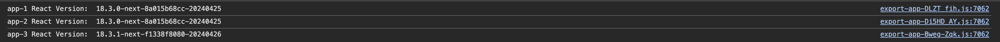

# Scoped Dependencies Example

This repository demonstrates that remote apps with the same scoped dependencies do not share the same instance of a
dependency.

## Project Structure

The repository contains an app shell and three apps running inside the app shell:

- `shell`
- `app-1` (React 18.3.0, @mui/material 6.1.0, share scope: "react@18.3.0")
- `app-2` (React 18.3.0, @mui/material 6.4.7, share scope: "react@18.3.0")
- `app-3` (React 18.3.1, @mui/material 6.4.7, share scope: "react@18.3.1")

## How to Run

1. Ensure Node.js and npm are installed.
2. Run `npm start` in the root folder. This will build and run all the apps.
3. Open the app shell at [http://localhost:5173/](http://localhost:5173/).

## Shared Dependency Configuration

There are two different share scopes: `react@18.3.0` and `react@18.3.1`. Shared dependencies include `react`,
`react-dom` and `@mui/material`.

| App   | react  | react-dom | @mui/material | Share Scope  |
|-------|--------|-----------|---------------|--------------|
| app-1 | 18.3.0 | 18.3.0    | 6.1.0         | react@18.3.0 |
| app-2 | 18.3.0 | 18.3.0    | 6.4.7         | react@18.3.0 |
| app-3 | 18.3.1 | 18.3.1    | 6.1.0         | react@18.3.1 |

## Expectations

1) The `react` and `react-dom` dependencies are shared between app-1 and app-2 (same share scope, singleton: true, same
   version).
2) `react` versions are not shared between different share scopes, singletons are bound to the shared scope.
3) The `@mui/material` dependency is not shared between app-1 and app-2 (singleton: false)
4) app-3 uses its own instance of  `@mui/material` 6.1.0 (different share scope).

These expectations are met with the rspack configuration. A runnable version of the rspack configuration is in the
`rspack` branch. The rspack configuration is also included in the main branch for reference.

## Vite Plugin issues:

with the vite plugin the expectations are not met:

- react is shared across share scopes, all apps run with react 18.3.1

After changing the vite plugin build as described in: https://github.com/module-federation/vite/pull/275

- react is only shared within share scopes

